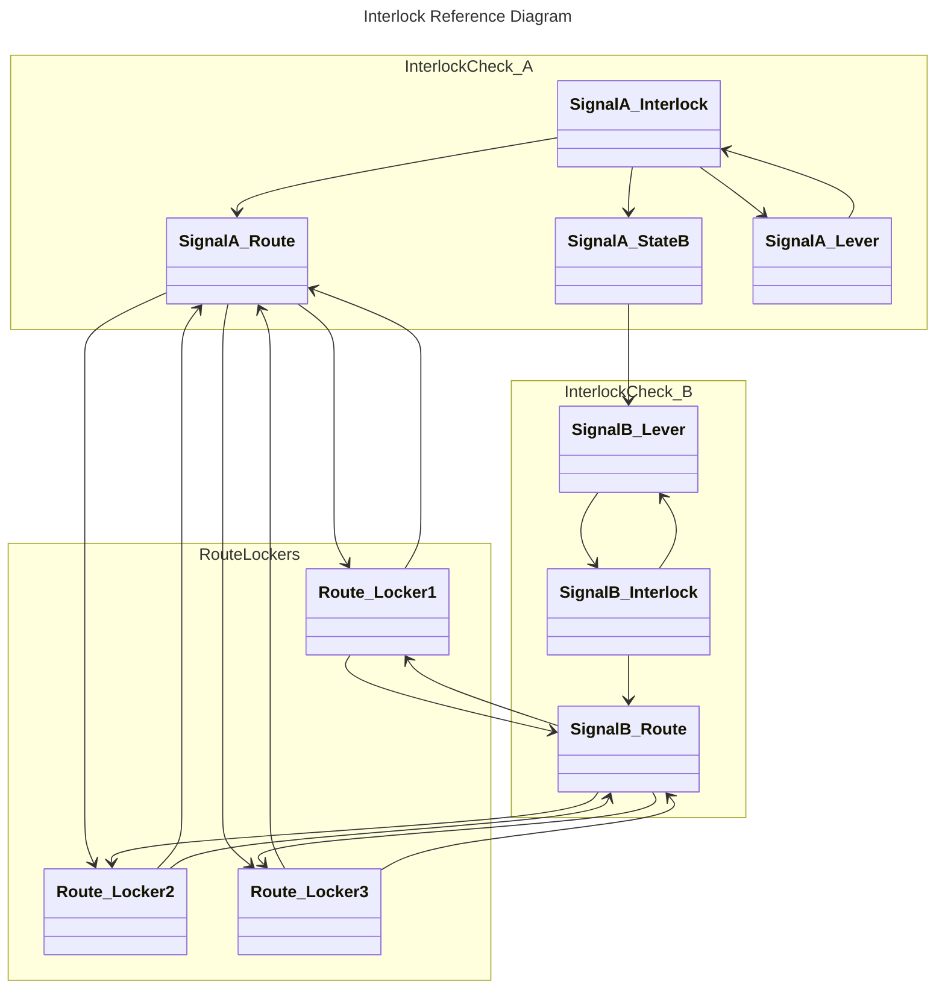

# RBUR-SignalIntegrator
## 概要
RBUR-SIはRBURに連携した信号を実装するパッケージです。

# 目次
- [ビルドプロセス](#ビルドプロセス)
- [コンポーネント](#コンポーネント)
- [Prefab](#prefab)
# ビルドプロセス
## Interlock_Pannel_BuildProcess
PointSetterからPointControllerLeverへコールバックを設定します
RouteLockerから関連するPointControllerLeverへの参照を張ります

Interlockingを起点にinterlock_Route、InterlockStateLocker、TargetSignalLockerからSignalControllerLeverを取得し、Interlockingへの逆参照を張ります

## Interlock_GACLink_BuildProcess
RouteLockerからPointSetterを経由し、近傍に制御しているGACコントローラーがあればそれへの参照を張ります

Interlockingを起点にinterlock_Route、InterlockStateLocker、TargetSignalLockerからGACLockerConsolidaterを取得し、Interlockingへの逆参照を張ります

## Interlock_BuildProcess
PointSetterからRouteChecker本体へコールバックを設定します
Interlocking、InterlockStateLocker、RouteLockerについて、参照しているLockerConsolidaterに自身を登録します。
RouteLocker、InterlockStateLockerから、Interlockingへの逆参照を張ります（例外用）

# コンポーネント
## GACLockerConsolidater

GACのコントローラーを連動装置によって制御するためのコンポーネントです。

### 仕様

|設定値|概要|
|---:|:---|
failSafeIndex|例外時に復帰される位置インデックスです
lockPositions|固定位置です。GACのpositionに対応します。同時に連動装置側で位置インデックスを取得する際の基準になります（例：0°、90°に設定すると、positionが0-45の時index=0、positionが45-90の時index=1となります）
target|制御されるコントローラーです。

## InterlockStateLocker

ある信号Aについて、他の信号Bを参照する場合に、信号Aを開けられる信号Bの状態を設定し、また信号Aの状態で信号Bをロックするためのコンポーネントです。

### 仕様

|設定値|概要|
|---:|:---|
AbstractLockerConsolidater|制御対象とするLockerです。
MeetPositionIndex|連動装置のロックを外す事のできる位置インデックスを設定します。

## RouteLocker

連動装置に対応する進路を設定し、また連動装置により進路を固定するためのコンポーネントです。

### 仕様
|設定値|概要|
|---:|:---|
TargetPoints|進路に関係するPointSetterです。
TargetRoute|各ポイントについて、連動装置のロックを外すことのできる進路のインデックスです。

設定した進路は、ギズモでプレビューされます。

## Interlocking

連動装置本体です。

### 仕様
|設定値|概要|
|---:|:---|
interlock_Route|進路確認・固定用のRouteLocker
interlockStates|他信号確認・固定用のInterlockStateLocker
TargetSignalLocker|連動される元のLockerConsolidater
SignalClosePositionIndex|信号を閉じた状態の位置インデックス
SignalOpenPositionIndex|信号を開いた状態の位置インデックス

# メモ

3位式の場内信号機には進路次第で進行と注意が出せて、進行が現示されたタイミングで方鎖錠が入る。これはてこ本体の下に注意と進行それぞれへ開通させようとするUdonを配置するのが良さそう。表示Animatorと内部てこを仲介するUdonが要る。 -> SignalEvaluator

将来的に防護区間の導入を企図する場合、連動盤から出力される現示を、防護するUdonで上書きするような仕組みを組めば良い。 -> SignalEvaluator

これ、現示出力イベントをリレーしていく組み方のほうがやりやすいんじゃないか？

てこを別途制御する（N,C,RのCの時とか）場合、Cに戻った事を検知できる必要がある。AbstractPanelControllerにコールバック配送を実装する必要がある -> 済み

http://mc.yukigaya-8.net/extra/files/tptk/2001handout.pdf

轍査鎖錠：主に分岐器に対して、その前後に車両の居る場合に途中転換を防ぐように設けられる。

進路鎖錠：このパッケージで主に扱っている物。

保留鎖錠：信号機と軌道から転轍機に対して設けられる。信号が反位かつ対象軌道内に車両が居た際に信号が定位になっても、一定時間は関係転轍機を鎖錠したままとする物。（30+ sec）

接近鎖錠：保留鎖錠の駅間を対象とした物

保留現示：軌道回路で赤にされたらそのままになる。再度てこが反位になると信号も反位になる

表示鎖錠：信号てこを定位に戻しても、信号が鎖状されていて信号が定位に戻らない時、信号側を優先する

# デバッグメモ

コールスタックを可視化した。
その結果、ネストが急速に深くなっていく問題が生じていることが分かった。イベント配送式はコールスタックを使い切ってしまう。
それを防ぐために、関係連動装置を事前に全て把握しておいた上で、連動状態変化によるてこ位置更新がなくなるまで、リミットありでループを回すやり方に改めるべき。

あるテコについてのInterlockingは、（進路検出を介する物を含めて）Lockerを参照する。

探索は以下のようになる
- Interlockingから、参照しているLockerを全てリストアップする
- リストアップしたLockerから、Interlockingへの逆参照を張る
- 上記を全てのInterlockingについて行う
- 1度逆参照が張られたら、もう一度Interlockingから、参照しているLockerを全てリストアップする
- Interlocking配下Lockerの状態が変化することで影響を受けるInterlockingの一覧は、LockerからInterlockingへの逆参照の和集合である。

- ユーザーの操作と、同期による変化を直接受けるInterlock、
- Interlocking_Aが状態を変化させることで影響を受け得るInterlockingの集合をPとする
- Interlockingは更新を行うと、1度自身の関連鎖錠を処理する。この際、状態更新のあったことを検知し、戻り値とする。
- Pに含まれるInterlockingがあれば、それに

信号Aの連動が標識Bの状態を参照し、標識Bの連動が信号Aの状態を参照しているような時、AとBを同時に開通させた際にどちらが開通するかが未定義となる。
これは同期の入れ違い時に各クライアントで表示が異なる結果を生むことになる。
標識Bは信号Aの状態を参照しなくても、通常は排他となる。
鎖錠が間に合わずAとBが同時に開通する状況になった場合、信号Aが標識Bの状態を参照して、標識Bは信号Aの状態を参照していなければ、信号A側が標識Bを強制的に定位に戻して解決される。

